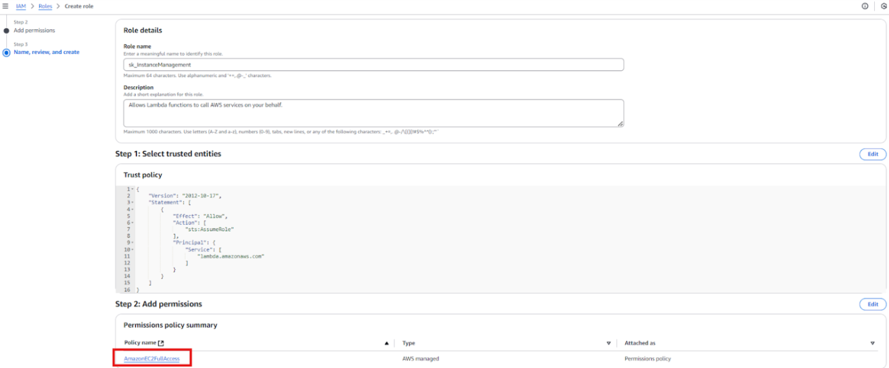
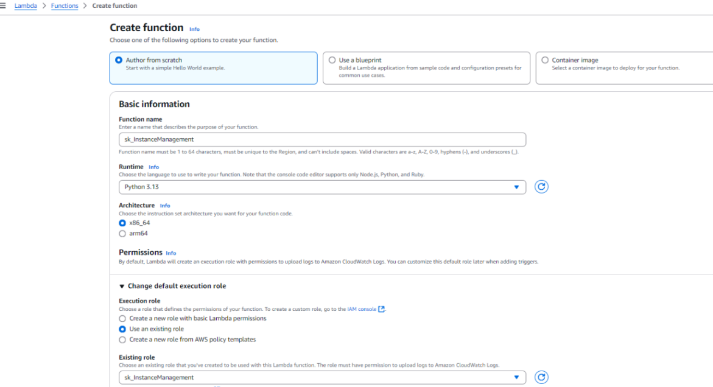
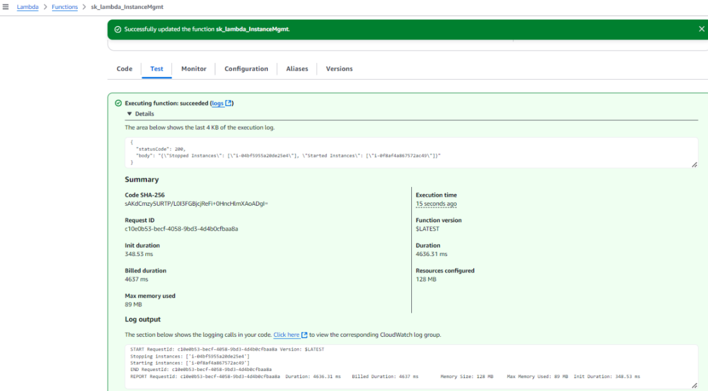
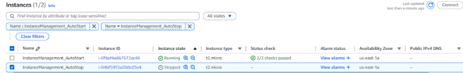

# 1: Automated Instance Management Using AWS Lambda and Boto3

## Objective
This demonstrates how to automate the stopping and starting of EC2 instances based on their tags using **AWS Lambda** and **Boto3**, Amazon's SDK for Python.

---

## Instructions

### 1. EC2 Setup
1. **Create EC2 Instances**:
   - Navigate to the [EC2 Dashboard].
   - Create **two t2.micro instances** .

2. **Add Tags**:
   - For the first instance:
     - Key: `Action`
     - Value: `Auto-Stop`
   - For the second instance:
     - Key: `Action`
     - Value: `Auto-Start`

---

### 2. Lambda IAM Role Setup
1. **Navigate to IAM Dashboard**:
   - Open the [IAM Console].
   - Create a new **IAM Role** for **AWS Lambda**.

2. **Attach Permissions**:
   - Attach the **AmazonEC2FullAccess** policy to the role.
     

---

### 3. Lambda Function Setup
1. **Create a New Function**:
   - Go to the [Lambda Console].
   - Click **Create function** and select:
     - **Author from scratch**.
     - Runtime: **Python 3.13**.
     - Assign the IAM role created earlier.
       

2. **Write the Lambda Code**:
   Use the following Python code for the Lambda function:
   

3. **Save and Deploy**:
   - Save the code and click **Deploy**.

---

### 4. Testing
1. **Manually Invoke the Function**:
   - In the Lambda Console, select the function and click **Test**.
   - Configure a test event (e.g., leave the default "Hello World" event).
     

2. **Verify Changes**:
   - Go to the [EC2 Dashboard].
   - Check the state of the two instances:
     - The instance tagged `Auto-Stop` should transition to **stopped**.
     - The instance tagged `Auto-Start` should transition to **running**.
       

