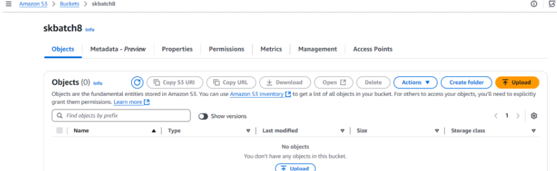

# Restore EC2 Instance from Snapshot

## Objective
This demonstrates how to automate the clean up old files in an S3 bucket.

---

## Instructions

### 1. S3 Setup
1. Navigate to the **S3 Dashboard** and create a new bucket.
2. Upload multiple files to this bucket, ensuring that some files are older than 30 days. 
   - You can simulate older files using the following command:
     ```bash
     sudo aws s3 cp ./scripts s3://<your-bucket-name>/ --recursive --metadata last-modified="2024-10-09T12:04:13"
     ```
     

---

### 2. Lambda IAM Role
1. Navigate to the **IAM Dashboard**.
2. Create a new role for **Lambda**.
3. Attach the `AmazonS3FullAccess` policy to the role.
   

---

### 3. Lambda Function
1. Navigate to the **Lambda Dashboard**.
2. Create a new function:
   - **Runtime**: Python 3.13
   - **Role**: Assign the IAM role created in the previous step.
     

3. Write the Lambda function using the following Boto3 script:
   [S3CleanUp.py](Scripts/S3CleanUp.py)
4. **Save and Deploy** the function.

---

### 4. Manual Invocation
1. After saving the Lambda function, manually trigger it:
   - In the **Lambda Console**, select the function and click **Test**.
   - Configure a test event (e.g., leave the default "Hello World" event).
     

2. Verify the results:
   - Navigate to the **S3 Dashboard**.
   - Confirm that only files newer than 30 days remain in the bucket.
     

---

