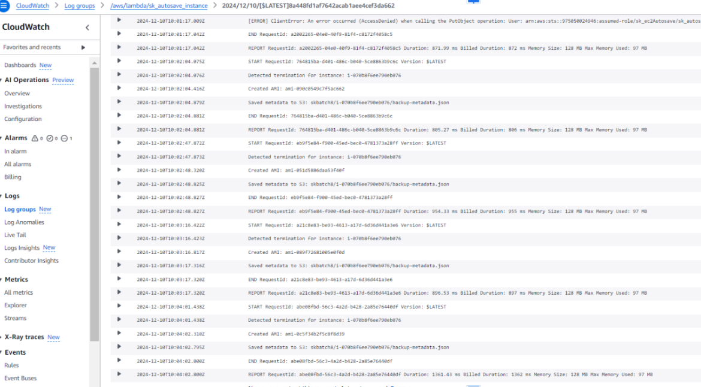

# Autosave EC2 Instance State Before Shutdown

## Objective
This demonstrates how to automatically save its current state to an S3 bucket before an EC2 instance is shut down.

---
## Prerequisites
1. Create new EC2 instance
2. Instance ID
3. bucket name where the current state of EC2 should be saved

## Instructions

---

### 1. Lambda IAM Role Setup
1. **Navigate to IAM Dashboard**:
   - Open the [IAM Console].
   - Create a new **IAM Role** for **AWS Lambda**.

2. **Attach Permissions**:
   - Attach the below policies to the role.
     

---

### 3. Lambda Function Setup
1. **Create a New Function**:
   - Go to the [Lambda Console].
   - Click **Create function** and select:
     - **Author from scratch**.
     - Runtime: **Python 3.13**.
     - Assign the IAM role created earlier.
       

2. **Write the Lambda Code**:
   Use the following Python code for the Lambda function:
   [ec2AutosaveInstance.py](Scripts/ec2AutosaveInstance.py)

3. **Save and Deploy**:
   - Save the code and click **Deploy**.

---

### 4. CloudWatch Events to trigger the Lambda function whenever an EC2 termination command is detected
1. **Create CloudWatch Event**:
   - Go to the [Amazon EventBridge console]
   - Click Rules --> Create rule and add target as the created lambda function, specific instance
     
   

### 4. Testing
**Verification**:
   - In the EC2 console, stop the instance and verify the cloudwatch logs to see whether the rule is triggered and lambda function is executed
     
   - Go to the S3 bucket to view whether the current state is saved in S3.
     

