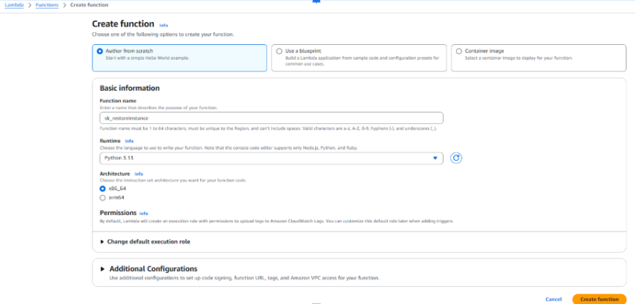
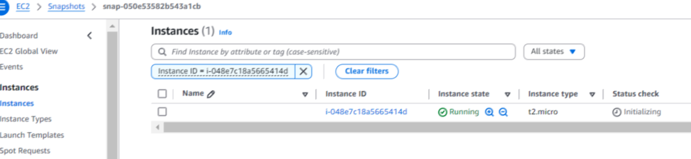

# Restore EC2 Instance from Snapshot

## Objective
This demonstrates how to automate the process of creating a new EC2 instance from the latest snapshot using a Lambda function

---
## Prerequisites
1. Make sure snapshots and AMI's are available for performing the operation. If snapshots are not present, spin a new EC2 instance --> take AMI & snapshot
2. REGION name
3. INSTANCE_TYPE = "t2.micro"  
4. AMI_ID
5. KEY_NAME
6. SECURITY_GROUP_IDS
7. SUBNET_ID
8. VOLUME_ID

-----

## Instructions

---

### 1. Lambda IAM Role Setup
1. **Navigate to IAM Dashboard**:
   - Open the [IAM Console].
   - Create a new **IAM Role** for **AWS Lambda**.

2. **Attach Permissions**:
   - Attach the **AmazonEC2FullAccess** policy to the role.
     

---

### 3. Lambda Function Setup
1. **Create a New Function**:
   - Go to the [Lambda Console].
   - Click **Create function** and select:
     - **Author from scratch**.
     - Runtime: **Python 3.13**.
     - Assign the IAM role created earlier.
       

2. **Write the Lambda Code**:
   Use the following Python code for the Lambda function:
   [ec2restoreInstance.py](Scripts/ec2restoreInstance.py)

3. **Save and Deploy**:
   - Save the code and click **Deploy**.

---

### 4. Testing
1. **Manually Invoke the Function**:
   - In the Lambda Console, select the function and click **Test**.
   - Configure a test event (e.g., leave the default "Hello World" event).
     

2. **Verify Changes**:
   - Go to the [EC2 Dashboard].
   - Check the newly created instance
       

